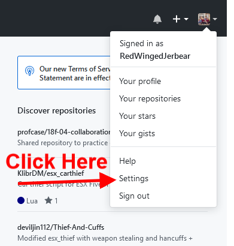
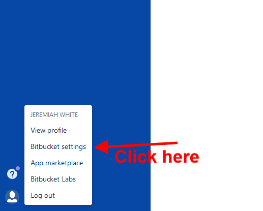
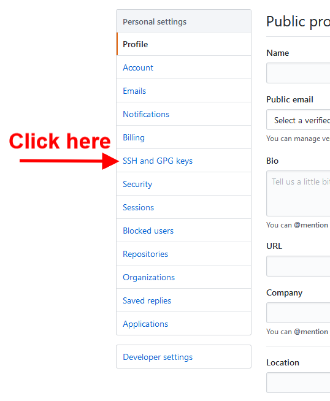
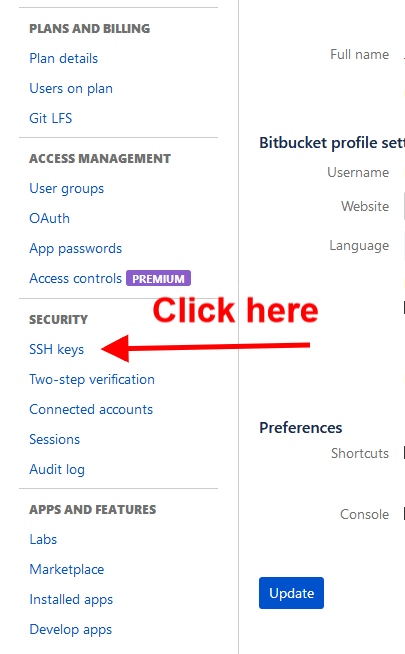
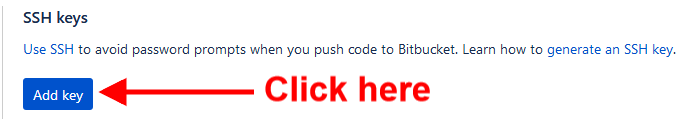
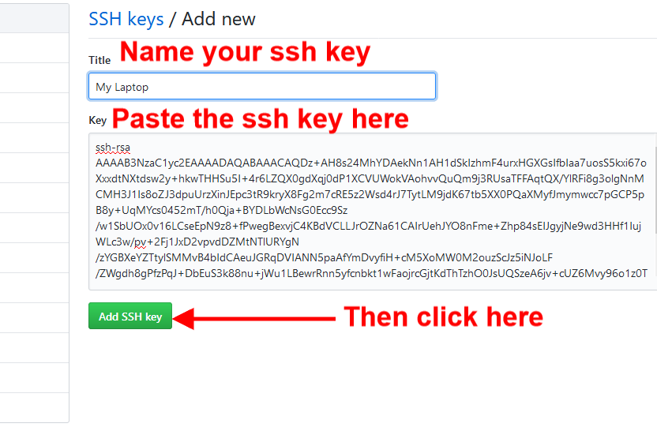
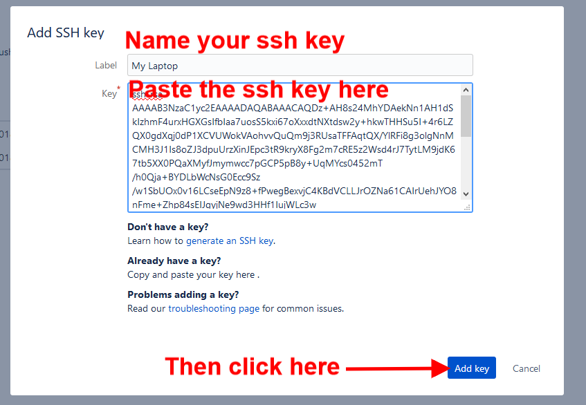

# GitSSHTuttorial
Tutorial for adding SSH keys to github/bitbucket.

## Generate an SSH key  

Using Git Bash Type the following command:

```
$ ssh-keygen -t rsa -b 4096 -C "white@nwmissouri.edu"
Generating public/private rsa key pair.
Enter file in which to save the key (/c/Users/s123456/.ssh/id_rsa):
```
Press enter to save the key to the defualt location.  
You will then be prompted to enter a pass phrase for the private key you have just generated.  

You will then need to add the SSH key to the ssh-agent. To do this type the following commands in git bash:  
```
$ eval $(ssh-agent -s)

$ ssh-add .ssh/id_rsa
```

Before moving on to the Git Hub or Bitbucket page we need to copy the ssh key to the clip board, which can be be accomplished by opening the ssh key in a text editor or typing the following command:
```
$ clip < .ssh/id_rsa.pub
```
## Add the SSH key to GitHub/Bitbucket 

### Go to your GitHub or Bitbucket page and click on your profile:     
 

### Click on the settings option:  
 

### Click the ssh key page:  
 

### Click on the add ssh key option:  
 

### Name your key and the paste the key which was copied to your clipboard earlier:  
 

## Test your key

For GitHub type this command in git bash:  
```
$ ssh -T git@github.com
```

For Bitbucket type this command in git bash:  
```
$ ssh -T git@bitbucket.org
```

If you get an error you messed up somewhere. If you get no error message, **congratulations!**